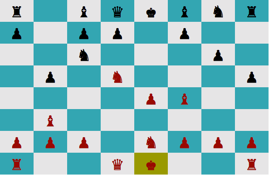

Hello, and welcome to GemChess!

GemChess is a computer chess program that runs in the terminal.  If you're
interested in playing against the GemChess engine, you'll need a Mac.  Just
download the project, navigate to the project directory, and then in the
terminal window type "ruby game.rb".  This will start a new game against the
computer.  Use WASD keys to move the cursor around and the space bar to select
and drop pieces.

If you're interested in reading the code, feel free to browse through the
code.  This program implements castling and promoting to a queen; en passant
and underpromotion are in the feature pipeline.

Feel free to send any questions or comments to gilansalehi@gmail.com with
GEMCHESS in the subject line.

Enjoy!
